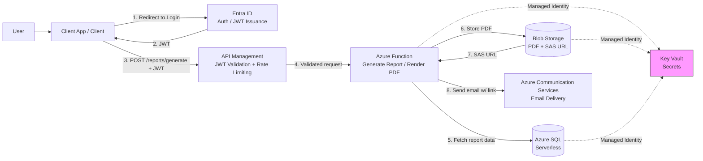
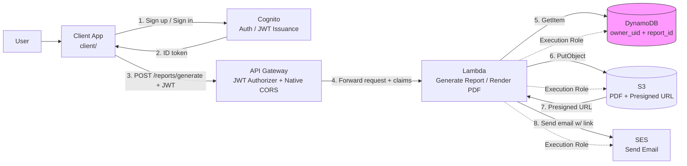
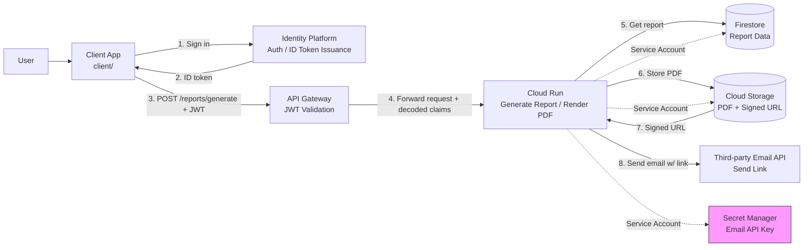
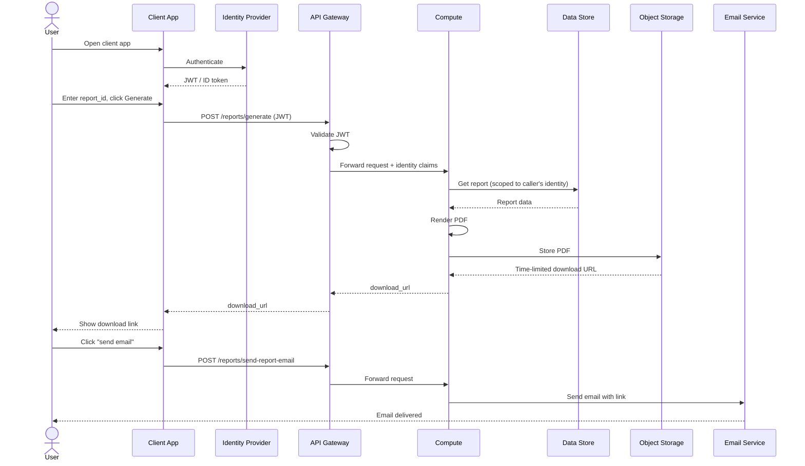

# Report Portal — Cloud Implementation Comparison

This document compares three implementations of the same application —
employees authenticate, request a payroll report, and receive a
time-limited PDF download link by email — one built natively for Azure,
one for GCP, and one for AWS. Each implementation is idiomatic to its
platform rather than a literal port of the others; this file exists as a
cross-reference and is included, identically, in all three repositories.

## Architecture at a glance

### Azure

### AWS

### GCP

## Service mapping

| Layer                | Azure                                    | GCP                                | AWS                                             |
| -------------------- | ---------------------------------------- | ---------------------------------- | ----------------------------------------------- |
| Auth                 | Entra ID (app registration, JWT)         | Identity Platform (email/password) | Cognito User Pools                              |
| API layer            | API Management (Consumption tier)        | API Gateway + OpenAPI template     | API Gateway (HTTP API)                          |
| Compute              | Azure Functions (Consumption)            | Cloud Run                          | Lambda                                          |
| File storage         | Blob Storage                             | Cloud Storage (GCS)                | S3                                              |
| Report data store    | Azure SQL (serverless, auto-pause)       | Firestore                          | DynamoDB (composite key: owner_uid + report_id) |
| Email delivery       | Communication Services (native)          | Third-party API (e.g. SendGrid)    | SES (native)                                    |
| Secrets              | Key Vault                                | Secret Manager                     | **None needed** — see note below                |
| Network isolation    | VNet + NSG + private endpoints           | None needed                        | None needed                                     |
| Compute identity     | Managed Identity                         | Service Account                    | Lambda execution role (IAM Role)                |
| Access-grant pattern | `rbac.tf` — centralized role assignments | IAM bindings, centralized at root  | IAM policies, centralized at root               |
| Terraform provider   | `azurerm`                                | `google` / `google-beta`           | `aws`                                           |
| Remote state backend | Azure Storage Account (blob container)   | GCS bucket                         | S3 bucket **+ DynamoDB lock table**             |

**Why AWS needs no Secrets row:** SES sends email via IAM permissions,
not an API key — so unlike GCP (which stores a third-party email
provider's API key in Secret Manager) or Azure (which stores SQL and ACS
connection strings in Key Vault), the AWS version has no application
secret to manage at all. Every credential in that design is an IAM role,
not a stored value.

## Architectural differences worth knowing

**CORS handling.** Azure (APIM) and AWS (API Gateway HTTP API) both
support CORS as a declarative policy block in Terraform — no application
code involved. GCP's API Gateway (built on ESPv2) has no CORS support of
its own; the Cloud Run application code has to implement `OPTIONS`
handling and set `Access-Control-*` headers itself. This is the one place
GCP's version needs meaningfully more application-layer code than the
other two.

**Signing time-limited download URLs.** All three use the same 48-hour
expiry pattern, but the mechanics differ:

- **Azure**: SAS token, generated directly against Blob Storage.
- **GCP**: Cloud Run has no private key locally, so signing a GCS URL
  requires impersonating its own service account via the IAM `signBlob`
  API (`roles/iam.serviceAccountTokenCreator`) — an easy permission to
  forget, since everything deploys fine without it and only fails the
  first time the signing code actually runs.
- **AWS**: Lambda's execution-role credentials sign the S3 presigned URL
  directly (SigV4) — no impersonation step needed.

**Enforcing report ownership.** All three validate the JWT once at the
API gateway layer and pass identity through to the compute layer rather
than trusting the request body. Where they differ is how the _data
layer_ enforces "this report belongs to this user":

- **Azure / GCP**: an application-level check after the read — fetch the
  report, then compare its owner field to the authenticated identity.
- **AWS**: enforced by the DynamoDB table's own key schema. The
  partition key is `owner_uid`, so a `GetItem` is scoped to
  `(caller's own uid, requested report_id)` at the database level — a
  report belonging to someone else is indistinguishable from "doesn't
  exist," rather than surfacing as an application-level 403.

**Network isolation.** Azure's design uses a VNet with NSGs and private
endpoints for SQL, Storage, and Key Vault — meaningful infrastructure on
its own (a full `modules/network`). Neither the GCP nor AWS versions need
this at all: Firestore/DynamoDB, Cloud Storage/S3, and Secret Manager/SES
are all reached over each provider's public API endpoints, gated by IAM
rather than network placement. This is the single biggest structural
difference between the Azure version and the other two — an entire
module category that simply doesn't exist on the other platforms for
this design.

**Deploying the application code.** All three keep app code out of
Terraform, deployed separately:

- **Azure**: Functions Core Tools (`func azure functionapp publish`).
- **GCP**: a container image, built and pushed to Artifact Registry.
- **AWS**: a zip file, built by `app/build.sh` and referenced by
  `lambda_package_path`.

**Client auth UX.** Same standalone email/password scope on all three,
but the actual sign-in experience differs meaningfully:

- **Azure**: MSAL.js, redirect-based — the browser leaves the page and
  comes back with an authorization code.
- **GCP**: Firebase Auth SDK, immediate sign-in — no redirect, no extra
  step after signup.
- **AWS**: no SDK at all (plain `fetch` calls to Cognito's public JSON
  API), but a **mandatory email confirmation code** step before first
  sign-in — the one client with an extra manual step baked into the
  identity provider's design, not a choice made in this project.

## Cost estimate comparison

All figures assume a personal learning deployment: spun up for a few
hours at a time, `terraform destroy`'d when not in use.

| Service role      | Azure                                       | GCP                                                                    | AWS                                        |
| ----------------- | ------------------------------------------- | ---------------------------------------------------------------------- | ------------------------------------------ |
| Compute           | Functions Consumption — ~$0                 | Cloud Run — ~$0 (free tier)                                            | Lambda — ~$0 (free tier)                   |
| API layer         | APIM Consumption — ~$0                      | API Gateway — ~$0 (free tier)                                          | API Gateway — ~$0                          |
| File storage      | Blob Storage — ~$1/month                    | Cloud Storage — ~$0 (free tier, region-locked)                         | S3 — ~$0–1/month                           |
| Report data store | Azure SQL serverless — ~$1–2/month          | Firestore — ~$0 (free tier)                                            | DynamoDB — ~$0 (free tier, permanent)      |
| Email             | Communication Services — ~$0 (100/day free) | Third-party (e.g. SendGrid) — ~$0 for a 60-day trial, then a real bill | SES — ~$0                                  |
| Secrets           | Key Vault — ~$1/month                       | Secret Manager — ~$0 (free tier)                                       | None needed — $0                           |
| Network           | Private endpoints — ~$0.01/hour each        | None — $0                                                              | None — $0                                  |
| Auth              | Entra ID — free at this scale               | Identity Platform — ~$0 (50,000 MAU free, permanent)                   | Cognito — ~$0 (10,000 MAU free, permanent) |

**The one real takeaway across all three:** GCP and AWS both get closer
to a genuine "\$0 while idle" story than Azure does. Nearly every GCP and
AWS service here has a **permanent** free tier at this usage level —
Firestore, DynamoDB, Cognito, and Identity Platform all have free
allowances that don't expire after 12 months the way S3 or EC2's do
elsewhere in AWS, or the way RDS/Aurora's newly-added free tier does.
Azure's version, by contrast, has a handful of small but real fixed
costs even with everything minimized — SQL serverless storage, Key
Vault operations, Blob Storage, and per-hour private endpoint charges —
landing around **\$3–5/month** even when actively destroyed between
sessions, versus an AWS or GCP bill that can realistically stay at
**\$0/month** indefinitely at this scale (with the caveat that GCP's
Cloud Storage free tier is region-locked, and any third-party email
provider on the GCP side has its own, separate, non-perpetual free tier
to track).

## Sequence diagram (generic flow)

The three implementations differ in service names and a handful of
mechanics (see above), but the request flow itself is identical across
all three. This diagram uses generic role labels; the legend below maps
each one to the actual service in each cloud.

| Generic label     | Azure                  | GCP               | AWS         |
| ----------------- | ---------------------- | ----------------- | ----------- |
| Identity Provider | Entra ID               | Identity Platform | Cognito     |
| API Gateway       | API Management         | API Gateway       | API Gateway |
| Compute           | Functions              | Cloud Run         | Lambda      |
| Data Store        | Azure SQL              | Firestore         | DynamoDB    |
| Object Storage    | Blob Storage           | Cloud Storage     | S3          |
| Email Service     | Communication Services | Third-party API   | SES         |

Note: the diagram omits two per-cloud specifics for clarity — AWS's
mandatory email-confirmation-code step before first sign-in, and GCP's
in-application CORS handling (both covered in the "Architectural
differences" section above).

## Which to build on

There's no universally "right" answer here — the honest summary:

- **Azure** is the closest fit if the organization already has Entra ID,
  or if VNet-based network isolation is a hard compliance requirement —
  it's also the version with the most infrastructure to reason about
  (private endpoints, NSGs, a dedicated network module).
- **GCP** is the simplest infrastructure of the three (no network module
  at all), but pushes the most complexity into application code (CORS
  handling) and has the one real external dependency (a third-party email
  vendor) the other two avoid.
- **AWS** ends up closest to a "batteries included" story for this
  specific design — native email (SES), declarative CORS, no
  self-impersonation trick for signed URLs, and a database schema that
  enforces access control by construction — at the cost of one AWS-
  specific operational quirk (the DynamoDB lock table for state) and a
  slightly clunkier auth UX (the mandatory confirmation code).
