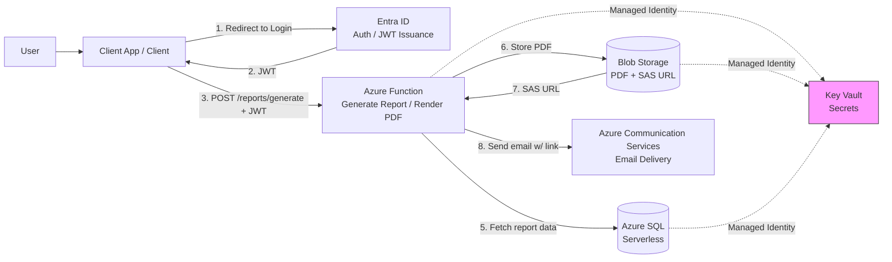
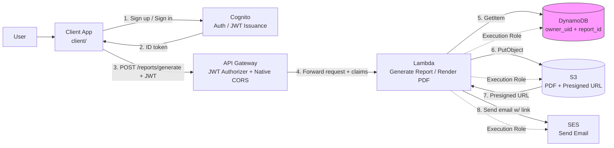
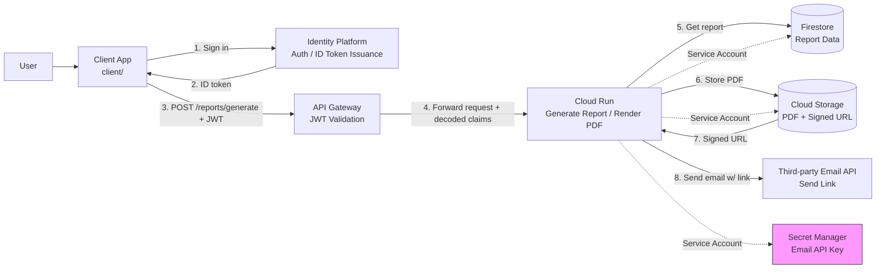
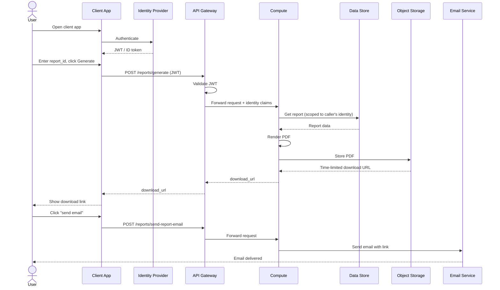

# Report Portal — Cloud Implementation Comparison

This document compares four implementations of the same application — employees authenticate, request a payroll report, and receive a time-limited PDF download link by email — built for Azure, GCP, AWS, and Oracle Cloud (OCI). Each implementation is idiomatic to its platform rather than a literal port of the others; this file exists as a cross-reference and is included, identically, in each repository. Azure, GCP, and AWS are fully built out (infra, app code, and a test client). The OCI column reflects an architecture decision, not yet an implemented repo — noted inline wherever a detail depends on choices not yet made.

## Architecture at a glance

### Azure

### AWS

### GCP

## Service mapping

| Layer                | Azure                                    | GCP                                | AWS                                             | OCI                                                                                                                                  |
| -------------------- | ---------------------------------------- | ---------------------------------- | ----------------------------------------------- | ------------------------------------------------------------------------------------------------------------------------------------ |
| Auth                 | Entra ID (app registration, JWT)         | Identity Platform (email/password) | Cognito User Pools                              | IAM Identity Domain (OAuth app, email/password)                                                                                      |
| API layer            | None — Easy Auth on the Function App     | API Gateway + OpenAPI template     | API Gateway (HTTP API)                          | API Gateway — declarative JWT authentication policy + declarative CORS                                                               |
| Compute              | Azure Functions (Consumption)            | Cloud Run                          | Lambda                                          | OCI Functions (Fn Project)                                                                                                           |
| File storage         | Blob Storage                             | Cloud Storage (GCS)                | S3                                              | Object Storage — Pre-Authenticated Requests (PARs) for time-limited links                                                            |
| Report data store    | Azure SQL (serverless, auto-pause)       | Firestore                          | DynamoDB (composite key: owner_uid + report_id) | Oracle NoSQL Database or Autonomous Database — undecided, see note below                                                             |
| Email delivery       | Communication Services (native)          | Third-party API (e.g. SendGrid)    | SES (native)                                    | Email Delivery (native)                                                                                                              |
| Secrets              | Key Vault                                | Secret Manager                     | **None needed** — see note below                | OCI Vault — needed only if Autonomous Database is chosen (wallet credentials); not needed with NoSQL                                 |
| Network isolation    | VNet + NSG + private endpoints           | None needed                        | None needed                                     | Likely none needed — same reasoning as GCP/AWS, not yet confirmed by an actual build                                                 |
| Compute identity     | Managed Identity                         | Service Account                    | Lambda execution role (IAM Role)                | Dynamic Group (matched by compartment/tag) + IAM policy                                                                              |
| Access-grant pattern | `rbac.tf` — centralized role assignments | IAM bindings, centralized at root  | IAM policies, centralized at root               | IAM policies, written in OCI's own human-readable statement syntax (e.g. `Allow dynamic-group X to manage objects in compartment Y`) |
| Terraform provider   | `azurerm`                                | `google` / `google-beta`           | `aws`                                           | `oracle/oci`                                                                                                                         |
| Remote state backend | Azure Storage Account (blob container)   | GCS bucket                         | S3 bucket **+ DynamoDB lock table**             | Object Storage bucket (planned)                                                                                                      |

**Why AWS needs no Secrets row:** SES sends email via IAM permissions, not an API key — so unlike GCP (which stores a third-party email provider's API key in Secret Manager) or Azure (which stores SQL and ACS connection strings in Key Vault), the AWS version has no application secret to manage at all. Every credential in that design is an IAM role, not a stored value.

**OCI's database decision is still open**, unlike the other three clouds where a choice was made and built. Both options here are genuinely strong: Oracle NoSQL Database's Always Free tier (3 tables, 25 GB each, 133 million reads/month, 133 million writes/month) is the most generous NoSQL free tier of any cloud in this comparison, and Autonomous Database's Always Free tier (2 instances, 20 GB each) is marketed as never expiring — a stronger "real SQL, genuinely free" story than even AWS's newly-added Aurora free tier, which is time-limited to 12 months.

## Architectural differences worth knowing

**CORS handling.** Azure (Function App `site_config.cors`), AWS (API Gateway HTTP API), and OCI (API Gateway) all configure CORS declaratively in Terraform — no application code involved. GCP's API Gateway (built on ESPv2) has no CORS support of its own; the Cloud Run application code has to implement `OPTIONS` handling and set `Access-Control-*` headers itself. This is the one place GCP's version needs meaningfully more application-layer code than the others.

**Signing time-limited download URLs.** All three built clouds use the same 48-hour expiry pattern, but the mechanics differ:

- **Azure**: SAS token, generated directly against Blob Storage.
- **GCP**: Cloud Run has no private key locally, so signing a GCS URL requires impersonating its own service account via the IAM `signBlob` API (`roles/iam.serviceAccountTokenCreator`) — an easy permission to forget, since everything deploys fine without it and only fails the first time the signing code actually runs.
- **AWS**: Lambda's execution-role credentials sign the S3 presigned URL directly (SigV4) — no impersonation step needed.
- **OCI**: Object Storage's Pre-Authenticated Request (PAR) is the equivalent mechanism — not yet implemented, so it's not yet known which of the Azure/AWS pattern (direct signing) or the GCP pattern (extra permission) it ends up resembling.

**Enforcing report ownership.** All three built clouds validate the JWT once at the API gateway layer and pass identity through to the compute layer rather than trusting the request body. Where they differ is how the _data layer_ enforces "this report belongs to this user":

- **Azure / GCP**: an application-level check after the read — fetch the report, then compare its owner field to the authenticated identity.
- **AWS**: enforced by the DynamoDB table's own key schema. The partition key is `owner_uid`, so a `GetItem` is scoped to `(caller's own uid, requested report_id)` at the database level — a report belonging to someone else is indistinguishable from "doesn't exist," rather than surfacing as an application-level 403.
- **OCI**: depends on the still-open NoSQL-vs-Autonomous-DB decision — Oracle NoSQL supports the same partition-key-based enforcement pattern as DynamoDB if chosen, which would make it the second cloud with schema-level ownership isolation rather than an application-level check.

**Network isolation.** Azure's design uses a VNet with NSGs and private endpoints for SQL, Storage, and Key Vault — meaningful infrastructure on its own (a full `modules/network`). Neither the GCP nor AWS versions need this at all: Firestore/DynamoDB, Cloud Storage/S3, and Secret Manager/SES are all reached over each provider's public API endpoints, gated by IAM rather than network placement. This is the single biggest structural difference between the Azure version and the other two — an entire module category that simply doesn't exist on the other platforms for this design. OCI likely follows the GCP/AWS pattern (Object Storage, Vault, Email Delivery, and NoSQL are all reachable over public OCI API endpoints, gated by IAM policies), but this hasn't been confirmed by an actual build yet.

**Deploying the application code.** All three built clouds keep app code out of Terraform, deployed separately:

- **Azure**: Functions Core Tools (`func azure functionapp publish`).
- **GCP**: a container image, built and pushed to Artifact Registry.
- **AWS**: a zip file, built by `app/build.sh` and referenced by `lambda_package_path`.
- **OCI**: OCI Functions deploys as a container image via the Fn CLI (`fn deploy`) — not yet built out.

**Client auth UX.** Same standalone email/password scope on all three built clouds, but the actual sign-in experience differs meaningfully:

- **Azure**: MSAL.js, redirect-based — the browser leaves the page and comes back with an authorization code.
- **GCP**: Firebase Auth SDK, immediate sign-in — no redirect, no extra step after signup.
- **AWS**: no SDK at all (plain `fetch` calls to Cognito's public JSON API), but a **mandatory email confirmation code** step before first sign-in — the one client with an extra manual step baked into the identity provider's design, not a choice made in this project.
- **OCI**: IAM Identity Domains supports both a direct OAuth2/OIDC flow and a hosted sign-in page — the actual client shape isn't built yet.

## Cost estimate comparison

All figures assume a personal learning deployment: spun up for a few hours at a time, `terraform destroy`'d when not in use.

| Service role      | Azure                                       | GCP                                                                    | AWS                                        | OCI                                                                                                                             |
| ----------------- | ------------------------------------------- | ---------------------------------------------------------------------- | ------------------------------------------ | ------------------------------------------------------------------------------------------------------------------------------- |
| Compute           | Functions Consumption — ~$0                 | Cloud Run — ~$0 (free tier)                                            | Lambda — ~$0 (free tier)                   | OCI Functions — ~$0, but free tier is only 10,000 invocations/month (smaller than Lambda's 1M or Cloud Run's 2M)                |
| API layer         | None — Easy Auth is free                    | API Gateway — ~$0 (free tier)                                          | API Gateway — ~$0                          | API Gateway — ~$0 at this scale                                                                                                 |
| File storage      | Blob Storage — ~$1/month                    | Cloud Storage — ~$0 (free tier, region-locked)                         | S3 — ~$0–1/month                           | Object Storage — ~$0 (200 GB free, forever — the most generous of the four)                                                     |
| Report data store | Azure SQL serverless — ~$1–2/month          | Firestore — ~$0 (free tier)                                            | DynamoDB — ~$0 (free tier, permanent)      | NoSQL — ~$0 (permanent, most generous free tier of the four) or Autonomous Database — ~$0 (permanent, 2 instances free forever) |
| Email             | Communication Services — ~$0 (100/day free) | Third-party (e.g. SendGrid) — ~$0 for a 60-day trial, then a real bill | SES — ~$0                                  | Email Delivery — likely ~$0 at this scale, exact free-tier limits not yet confirmed                                             |
| Secrets           | Key Vault — ~$1/month                       | Secret Manager — ~$0 (free tier)                                       | None needed — $0                           | Vault — ~$0, only needed if Autonomous Database is chosen                                                                       |
| Network           | Private endpoints — ~$0.01/hour each        | None — $0                                                              | None — $0                                  | Likely none — $0, not yet confirmed                                                                                             |
| Auth              | Entra ID — free at this scale               | Identity Platform — ~$0 (50,000 MAU free, permanent)                   | Cognito — ~$0 (10,000 MAU free, permanent) | IAM Identity Domain — free at this scale                                                                                        |

**The one real takeaway across all four:** OCI's Always Free tier is arguably the most generous of the four for this exact use case — Object Storage (200 GB, forever), Oracle NoSQL (133 million reads/month, forever), and Autonomous Database (2 instances, forever, explicitly marketed as never expiring) all beat their equivalents on the other three clouds. The one place OCI is actually stingier than the others is Functions' invocation quota (10,000/month, versus 1–2 million elsewhere) — not a real constraint at this project's scale, but worth knowing if usage ever grows. GCP and AWS both get closer to a genuine "$0 while idle" story than Azure: nearly every GCP and AWS service here has a **permanent** free tier at this usage level, while Azure's version has a handful of small but real fixed costs even with everything minimized — SQL serverless storage, Key Vault operations, Blob Storage, and per-hour private endpoint charges — landing around **\$3–5/month** even when actively destroyed between sessions, versus an AWS, GCP, or OCI bill that can realistically stay at **$0/month** indefinitely at this scale (with the caveat that GCP's Cloud Storage free tier is region-locked, and any third-party email provider on the GCP side has its own, separate, non-perpetual free tier to track).

## Sequence diagram (generic flow)

The implementations differ in service names and a handful of mechanics (see above), but the request flow itself is the same shape across all four. This diagram uses generic role labels; the legend below maps each one to the actual service in each cloud.

| Generic label     | Azure                  | GCP               | AWS         | OCI                         |
| ----------------- | ---------------------- | ----------------- | ----------- | --------------------------- |
| Identity Provider | Entra ID               | Identity Platform | Cognito     | IAM Identity Domain         |
| API Gateway       | None (Easy Auth)       | API Gateway       | API Gateway | API Gateway                 |
| Compute           | Functions              | Cloud Run         | Lambda      | OCI Functions               |
| Data Store        | Azure SQL              | Firestore         | DynamoDB    | NoSQL / Autonomous Database |
| Object Storage    | Blob Storage           | Cloud Storage     | S3          | Object Storage              |
| Email Service     | Communication Services | Third-party API   | SES         | Email Delivery              |

Note: the diagram omits per-cloud specifics for clarity — AWS's mandatory email-confirmation-code step before first sign-in, GCP's in-application CORS handling, and (for OCI) any implementation-specific detail not yet settled by an actual build. All are covered in the "Architectural differences" section above.

## Which to build on

There's no universally "right" answer here — the honest summary:

- **Azure** is the closest fit if the organization already has Entra ID, or if VNet-based network isolation is a hard compliance requirement — it's also the version with the most infrastructure to reason about (private endpoints, NSGs, a dedicated network module).
- **GCP** is the simplest infrastructure of the three built clouds (no network module at all), but pushes the most complexity into application code (CORS handling) and has the one real external dependency (a third-party email vendor) the others avoid.
- **AWS** ends up closest to a "batteries included" story for this specific design — native email (SES), declarative CORS, no self-impersonation trick for signed URLs, and a database schema that enforces access control by construction — at the cost of one AWS-specific operational quirk (the DynamoDB lock table for state) and a slightly clunkier auth UX (the mandatory confirmation code).
- **OCI** looks like the strongest free-tier story of all four on paper — the most generous Object Storage and database free tiers, declarative JWT + CORS at the gateway like Azure and AWS — but this is still an architecture on paper, not a build: it's the cloud with the most upside and the least validated by actually running it.

## Going to production

Everything above assumes a learning deployment. At production scale — call it 5,000 reports/day, roughly 150,000/month — the picture changes in a way that's worth stating plainly: **the metered usage is still nearly noise on all four clouds.** What you start paying for is availability, and what actually breaks first is the request shape, not the throughput.

### The change that applies everywhere: synchronous → asynchronous

Payroll traffic isn't smooth. It's near-zero for thirteen days, then tens of thousands of requests in the two hours after payday notifications go out. Peak concurrency sizes this system, not average throughput — and PDF rendering (1–3 seconds, CPU-heavy) is the wrong thing to do inside a request holding a connection open. The fix is the same shape on every cloud: `POST /reports/generate` returns `202 Accepted` with a job ID and enqueues the work; a worker renders, stores, and emails. The queue absorbs the burst, retries and dead-lettering come free, and the two client-facing endpoints collapse into one.

| Cloud | Queue                        | Worker trigger              |
| ----- | ---------------------------- | --------------------------- |
| Azure | Storage Queue or Service Bus | Queue-triggered Function    |
| GCP   | Pub/Sub or Cloud Tasks       | Cloud Run push subscription |
| AWS   | SQS + DLQ                    | Lambda event source mapping |
| OCI   | OCI Queue                    | Function                    |

### Other changes that apply regardless of cloud

- **Idempotency and reuse.** Store the generated object key and timestamp on the report record; reissue a URL against the existing object rather than re-rendering. On a payday burst with people clicking twice, this removes a large fraction of rendering load.
- **A retention bug all four repos share.** Every version sets a ~7-day lifecycle deletion on the bucket. That's fine for a demo and wrong for payroll: paystubs are financial records with multi-year retention obligations in most jurisdictions. The _download link_ expiring in 48 hours is correct; the _underlying object_ vanishing is not. These need decoupling before launch.
- **Observability, and its bill.** Log ingestion is frequently a top-three line item at this scale, often exceeding compute. Budget $10–50/month per cloud and sample aggressively. Alert on queue depth and dead-letter count, not just error rates.
- **Secret rotation.** Any hardcoded expiry dates become scheduled outages unless something rotates them.
- **Per-user rate limits** rather than a single global ceiling, so one client can't exhaust the quota for everyone.

### Production changes and costs, by cloud

|           | Main production changes                                                                                                                         | Rough monthly at ~150k reports |
| --------- | ----------------------------------------------------------------------------------------------------------------------------------------------- | ------------------------------ |
| **Azure** | Functions Consumption → Premium for warm instances and VNet; actively re-decide the SQL tier; optionally add Front Door + WAF for rate limiting | **~$150–400**                  |
| **GCP**   | Cloud Run minimum instances to kill cold starts; the third-party email vendor becomes a real, non-trivial bill                                  | **~$130–200**                  |
| **AWS**   | Provisioned concurrency for burst absorption; leave the SES sandbox                                                                             | **~$50–100**                   |
| **OCI**   | Exceeds the 10,000/month Functions free tier; verify the unverified pieces before anything else                                                 | **~$30–70**                    |

**Azure is the most expensive**. Functions Consumption → Premium adds ~$150–250 for warm instances and VNet. And the subtle one: **Azure SQL serverless stops being the cheap option once traffic is steady.** Auto-pause was the entire reason it was attractive, and it will essentially never trigger now; continuous serverless billing runs well above equivalent provisioned compute. Add ~$30/month of private endpoints the other three designs don't have at all.

**GCP's production cost is dominated by the one component that isn't Google's.** Everything native stays cheap — Firestore at this volume is a couple of dollars, API Gateway is still inside its free tier. But a third-party email provider at 150k/month runs around $90/month, more than the entire rest of the GCP stack combined.

**AWS is cheapest of the three built-out clouds**, largely on email: SES at $0.10 per 1,000 puts 150k emails at ~$15. DynamoDB on-demand and Lambda both stay near-free at this volume, and the composite-key design needs no change at all.

**OCI likely stays cheapest overall** — the Functions free-tier overage is small, and NoSQL, Object Storage, and egress allowances all still cover this scale. The caveat is that it's also the stack with the most unverified pieces, so "cheapest" carries the most implementation risk.

### The thing worth internalizing

On every cloud, metered usage at 150k requests/month is close to noise. The bill is almost entirely **fixed floors added to buy availability** — SLA-backed gateway tiers, warm instances, always-on database compute, redundancy. That's why Azure lands 5–10× above OCI here despite doing identical work: it isn't more expensive per request, it just has higher minimum entry prices for production-grade tiers.

All figures here are order-of-magnitude and worth re-deriving against each provider's own calculator before committing.
