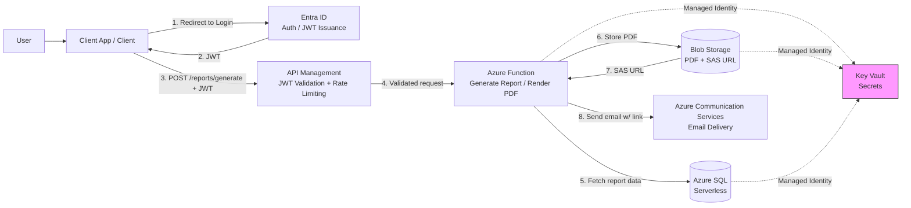
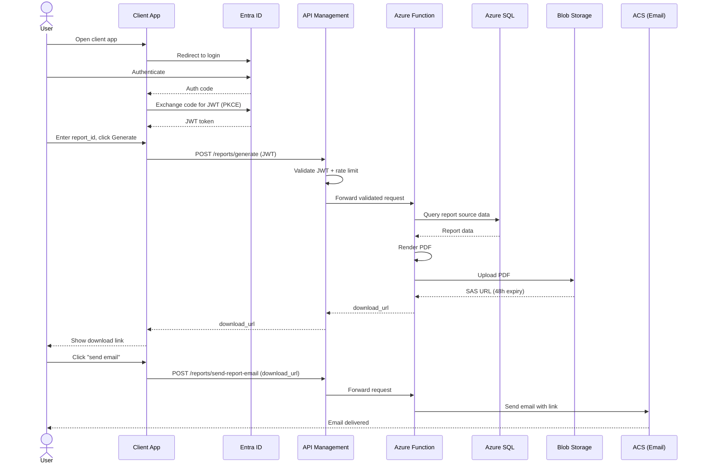

# Report Portal — Azure Infrastructure (Terraform)

A production-realistic Azure infrastructure project provisioned entirely with Terraform. Users authenticate via Entra ID, request a report through a secured API, and receive a time-limited PDF download link by email.
The pattern is intentionally generic, it applies equally to invoices, payroll documents, analytics exports, compliance reports, or any scenario where a user needs an on-demand generated document delivered securely.

---

## Architecture

### Flowchart



### Sequence Diagram



All secrets are stored in Key Vault. All service-to-service access uses managed identities — no credentials in code or app settings.

---

## Azure services used

| Service                      | Purpose                                          |
| ---------------------------- | ------------------------------------------------ |
| Entra ID (app registration)  | User authentication, JWT issuance                |
| API Management               | JWT validation, rate limiting, stable API facade |
| Azure Functions              | Report generation, PDF rendering, email dispatch |
| Azure Blob Storage           | Generated PDF storage with SAS URL access        |
| Azure SQL (serverless)       | Relational data store for report source data     |
| Azure Communication Services | Transactional email delivery                     |
| Azure Key Vault              | Secrets, connection strings, managed access      |
| VNet + NSG                   | Network isolation                                |

---

## Repository structure

```
azure_report_portal/
│
├── terraform.tfvars.example   # Variable template (copy to terraform.tfvars)
├── .gitignore
└──  client/               # Minimal static test client (MSAL.js, no build step)
│   ├── index.html
│   ├── app.js
│   ├── config.example.js
│   └── README.md               # Application code, deployed separately from infra
└──  environments/              # Environments
│   ├── dev
      ├── variables.tf          # All input variables
      ├── outputs.tf            # Function URL, storage account name, etc.
└── functions/                  # Application code, deployed separately from infra
│   ├── function_app.py         # generate_report + send_report_email
│   ├── pdf_builder.py
│   ├── requirements.txt
│   ├── host.json
│   ├── local.settings.json.example
└──  modules/              # Modules
│   ├── apim               # API Management, API definition, JWT policy
│   ├── networking         # VNet, subnet, NSG, private endpoints
│   ├── identity           # Entra ID app registration, managed identities, workload identity federation
│   ├── keyvault           # Key Vault, RBAC-based access, secrets
│   ├── storage            # Blob Storage account and reports container
│   ├── database           # Azure SQL server and serverless database
│   ├── functions          # App Service Plan, Function App, app settings
│   ├── communication      # ACS resource and email domain
└── scripts/
│   ├── seed.sql
```

---

## Prerequisites

- [Terraform](https://developer.hashicorp.com/terraform/install) >= 1.5
- [Azure CLI](https://learn.microsoft.com/en-us/cli/azure/install-azure-cli) installed and logged in
- An Azure subscription
- Contributor access on the subscription (for role assignments, Owner is required)

---

## Getting started

**1. Clone the repository**

```bash
git clone https://github.com/maxim-grin/azure_report_portal.git
cd azure_report_portal
```

**2. Install dependencies for pre-commit-terraform, if you want to do any code modifications**

[pre-commit-terraform dependencies] (https://github.com/antonbabenko/pre-commit-terraform#1-install-dependencies)
for example, MacOS dependencies look like:

```bash
brew install pre-commit terraform-docs tflint tfsec trivy checkov terrascan infracost tfupdate minamijoyo/hcledit/hcledit jq
```

Then install pre-commit for the repo

```bash
pre-commit install
```

To trigger it manually run

```bash
pre-commit run -a
```

**3. Create the remote state backend**

Create a storage account manually for Terraform state — this is intentionally outside Terraform so state itself has a stable home.

```bash
az group create --name rg-tfstate --location westus2
az storage account create \
  --name yourstateaccount \
  --resource-group rg-tfstate \
  --sku Standard_LRS
az storage container create \
  --name tfstate \
  --account-name yourstateaccount
```

Update the backend block in `main.tf` with your storage account name.

**4. Configure variables**

```bash
cp terraform.tfvars.example terraform.tfvars
```

Edit `terraform.tfvars` with your values. This file is gitignored — never commit it.

**5. Initialise and apply**

```bash
cp backend.hcl.example backend.hcl
# edit backend.hcl with your actual bucket/table names

terraform init -backend-config=backend.hcl
terraform plan
terraform apply
```

> Note: API Management takes 30–45 minutes to provision even on the Consumption tier. This is expected — grab a coffee.

---

## Seeding sample data

After terraform apply, seed sample expense report data via Azure Portal:

1. Navigate to your SQL database → Query editor (preview)
2. Sign in with AAD or SQL credentials
3. Run functions/scripts/seed.sql

This creates one expense report with five line items, owned by user-001.

## Deploying function code

```bash
 cd functions
 func azure functionapp publish reportportal-dev-func
```

Requires Azure Functions Core Tools.

See `functions/TESTING.md` for local testing, smoke tests, and full auth-flow verification.

## Testing the flow

1. Sign in through client/ (see client/README.md for one-time Entra ID + APIM setup), or get a JWT via the Functions emulator's dev auth
2. Click "generate" (or POST /reports/generate directly) with a report_id from seed data
3. Returns a download_url — fetch it, confirm PDF renders correctly
4. POST /reports/send-report-email with the same download_url
5. Confirm email arrives (check ACS delivery report in Azure Portal if not)

## Key Terraform patterns demonstrated

**Managed identities, not shared secrets** — service-to-service access uses `azurerm_role_assignment` and managed identities rather than connection strings or shared keys. Every role assignment lives in `rbac.tf` for a single-file audit trail of who has access to what. Only the service that needs Key Vault access gets a role assignment — nothing else does, by default-deny.

**Private endpoints over service endpoints** — Key Vault and the SQL database sit behind private endpoints rather than public access secured by IP allowlisting. Private endpoints give the resource a private IP inside the VNet and remove it from the public internet entirely; service endpoints route traffic over the Azure backbone too, but the resource keeps a public IP and relies on firewall rules to restrict access. For sensitive data, private endpoints are the stronger default.

**Remote state** — state is stored in Azure Blob Storage from day one, matching real team workflows.

**Naming convention via locals** — all resource names are derived from a single prefix defined in `locals.tf`, keeping names consistent without repetition.

**Random suffix for globally unique names** — storage account names use a `random_string` resource to avoid conflicts across deployments.

**Serverless SQL** — Azure SQL is provisioned on the serverless tier so compute pauses when idle, keeping costs low for a non-production deployment.

**SAS URL pattern** — the Function generates a time-limited signed URL for each generated report rather than attaching files directly to emails, providing both an audit trail and a smaller attack surface.

---

## Security decisions worth noting

- JWT validation happens at APIM — Functions receive only pre-validated requests
- User identity is extracted from token claims, never from request parameters
- Blob paths include a UUID component to prevent enumeration
- SAS URLs expire after 48 hours
- Key Vault and SQL sit behind private endpoints, not public access with IP rules
- Key Vault access uses managed identities, not access keys or shared secrets
- NSG rules restrict inbound traffic to APIM only
- **APIM is intentionally not deployed inside a virtual network, and public
  network access is not disabled.** Consumption tier supports neither
  `virtual_network_type` (VNet integration) nor private endpoints / disabling
  public access — those require Developer, Basic, Standard, or Premium tier.
  This is a hard platform ceiling, not a config gap: there's no Terraform
  setting that closes it while staying on Consumption.
  Moving to Developer tier (~$50/month) or Premium (~$2,700+/month) would
  close both findings. See the Cost estimate section below.
- **Minimum TLS 1.2 is enforced on Azure SQL** (`minimum_tls_version = "1.2"`)
  — this matches Azure's own default, made explicit for scanning tools that
  can't see runtime defaults.
- **Ledger and zone redundancy are not enabled on Azure SQL.** Ledger
  (`CKV_AZURE_224`) would make every table append-only by default and
  requires GRS/ZRS digest storage — a schema-level and infra change beyond
  this deployment's scope, not a simple toggle. Zone redundancy
  (`CKV_AZURE_229`) isn't available on General Purpose serverless at all;
  it requires Premium, Business Critical, or Hyperscale, reintroducing the
  always-on cost this project is designed to avoid. Both findings are
  suppressed with inline `#checkov:skip` comments explaining why.
- **The Function App's service plan has no zone redundancy or minimum
  instance guarantee.** Both require leaving Consumption (`Y1`) for an
  Elastic Premium plan, which also mandates a minimum of three always-ready
  instances once zone redundancy is enabled — a jump from near-zero cost to
  roughly $150–250+/month before scaling.

---

## Cost estimate

For a personal learning deployment, spun up for a few hours at a time and destroyed when not in use:

| Service                            | Billing model                     | Realistic cost   |
| ---------------------------------- | --------------------------------- | ---------------- |
| Azure Functions (Consumption)      | Per execution                     | ~$0 (free tier)  |
| Azure SQL (Serverless, auto-pause) | Per vCore-second when active      | ~$1–2/month      |
| API Management (Consumption tier)  | Per million calls (1M free/month) | ~$0              |
| Blob Storage                       | Per GB + transactions             | ~$1/month        |
| Azure Communication Services       | Per email (100/day free)          | ~$0              |
| Key Vault                          | Per 10,000 operations             | ~$1/month        |
| Private endpoints                  | Per hour, per endpoint            | ~$0.01/hour each |

All Azure billing here is fractional/hourly or per-call, not a flat monthly charge. Running this for a weekend costs cents, not dollars. Always `terraform destroy` when you're done with a session — private endpoints and SQL serverless compute are the main per-hour costs if left running.
**Note:** these figures assume APIM stays on the Consumption tier. Moving to Developer or Premium — e.g. to satisfy VNet-integration requirements replaces the ~$0 APIM line with a flat ~$50/month (Developer) or ~$2,700+/month (Premium) cost, independent of usage.

---

## What's intentionally out of scope

- CI/CD pipeline for the Terraform itself
- Custom email domain DNS verification (documented in ACS setup, completed manually)
- Production hardening beyond what's described here (WAF rules tuning on APIM/Front Door, DDoS Standard protection, multi-region failover)

---

<!-- BEGINNING OF PRE-COMMIT-TERRAFORM DOCS HOOK -->

auto populated information

<!-- END OF PRE-COMMIT-TERRAFORM DOCS HOOK -->

## Learning resources

- [Terraform AzureRM provider docs](https://registry.terraform.io/providers/hashicorp/azurerm/latest/docs)
- [HashiCorp Learn — Get started with Azure](https://developer.hashicorp.com/terraform/tutorials/azure-get-started)
- [Azure Architecture Center](https://learn.microsoft.com/en-us/azure/architecture/)

---

## License

MIT
